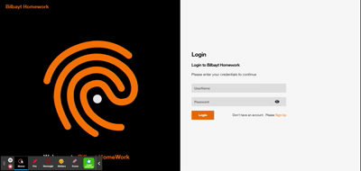

<p align="center" >
<p align="center" >
   <a href="#">
    
 </a>

</p>

<h3 align="center">
  ☮ Bilbayt Homework
</h3>
<p align="center">
  Homework give by Bilbayt for a recruiting process
</p>

# Bilbayt Homework

Basic Authentication Application, build using .Net Core and ReactJs with Onion Architecture and CQRS pattern.

It's a Homework give by Bilbayt for a recruiting process.

It's my first time taking a test like this, so I was a little nervous. I hope I didn't overdo it.

## Authors

- [@kemsty2](https://www.github.com/kemsty2)

## Features

- [x] Register with your username, password, fullname
- [x] Receive Welcoming Mail after Registration
- [x] Login after registration
- [x] See your profile after login

## Project Structures
```text
Bilbayt.Homework.Api/
├── Bilbayt.Homework.Api/ #Presentational Layer
│   ├── Controllers
└── Bilbayt.Homework.Domain/ (Domain Enties Layers)
|   ├── Common/
|   ├── Entities/
|   ├── Models/
|   ├── Enum/
|   ├── Settings/
└── Bilbayt.Homework.Insfrastructure/ (Infrastructure Layers for 3th part apps)
|   ├── Extension/
|   ├── Filters/
|   ├── Mapping/
|   ├── Middleware/
|   ├── ViewModel/
└── Bilbayt.Homework.Persistence/ (Persistence Layer for data management)
|   ├── Repositories/
└── Bilbayt.Homework.Service/ (Core of the app, Service Layer)
|   ├── Contract/
|   ├── Exceptions/
|   ├── Features/
|   ├── Helpers/
|   ├── Implementation/
|   ├── Middleware/
└── Bilbayt.Homework.Api.Test.Integration/ (Integration tests)
|   ├── Base/
|   ├── Common/
|   ├── Controllers/
|   ├── Seeds/
|   ├── Services/
Bilbayt.Homework.Web/
└── ClientApp/
|   ├── public/
|   ├── src/
|   |   ├── assets/ (Contains all project assets (images, additionnals)stylesheets)
|   |   ├── components/ (Contains all the atomic components, layout and Hocs)
|   |   ├── configs/ (Contains all the config of the app)
|   |   ├── containers/ (contains compenent link with redux)
|   |   ├── middlewares/ (contains all the axios middleware)
|   |   ├── pages/ (contains all the page of the project)
|   |   ├── routes/ (contains the routes configuration - react-router)
|   |   ├── store/ (contains the redux store configuration)
|   |   ├── utils/ (contains some useful configuration)
```
## Environment Variables

To run this project, you will need to configure the folliwing configuration,

- ./Bilbayt.Homework.Api/Bilbayt.Homework.Api/appsettings.json

```json
"MongoDbSettings": {
    "ConnectionString": "mongodb://localhost:27017",
    "DatabaseName": "bilbayt-homework-db"
},
"SendGridSettings": {
    "ApiKey": "Your-Sendgrid Api Key",
    "TemplateId": "Your Sendgrid Welcoming Email Template Id",
    "SenderEmail": "Your Sendgrid Sender Email",
    "SenderName": "Your Sendgrid Sender Email"
}
```

- ./Bilbayt.Homework.Web/ClientApp/public/config.js
```js
/*
* Api Endpoint
* When running using docker-compose, 
* it's http://*localhost:8000, locally it's https://localhost:5003
*/
window.env = { BASE_URL: "https://localhost:5003" };

```

For testing purpose ,i've left my sendgrid api key in the project appsettings

## Deployment

To run this project locally, you can,

- Use Docker with docker-compose

  ```bash
  docker-compose up
  ```

  Access Aplication on http://localhost:8001

- Use dotnet-cli

  ```bash
  dotnet run --project ./Bilbayt.Homework.Api/Bilbayt.Homework.Api/Bilbayt.Homework.Api.csproj
  dotnet run --project ./Bilbayt.Homework.Web/Bilbayt.Homework.Web.csproj
  ```

  Access Aplication on https://localhost:5001

## Running Tests

To run tests, run the following command

```bash
  dotnet test
```

## License

[MIT](https://choosealicense.com/licenses/mit/)
